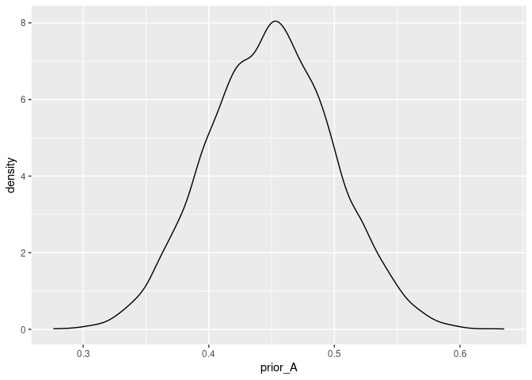
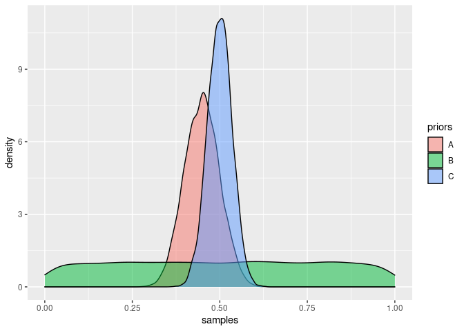
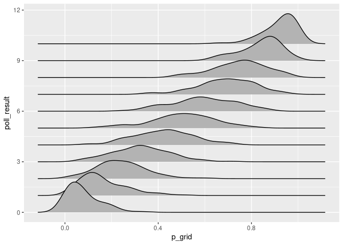
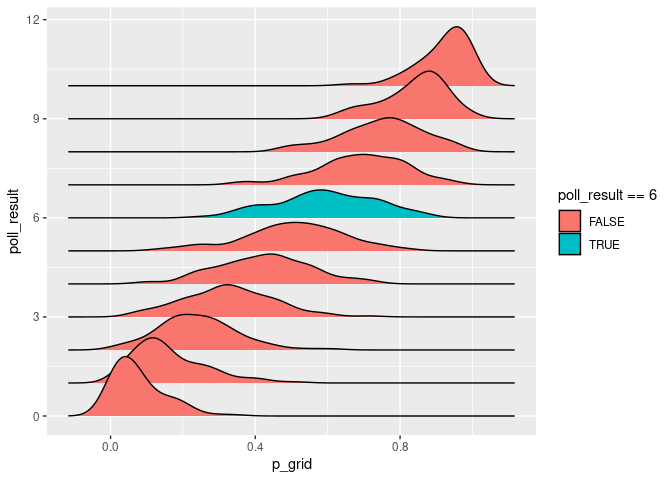
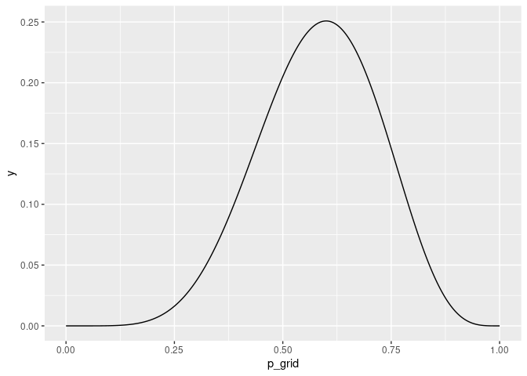
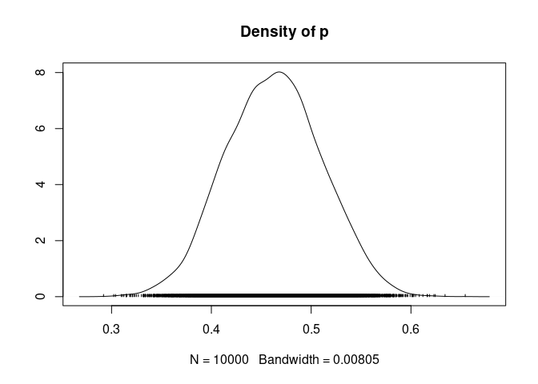
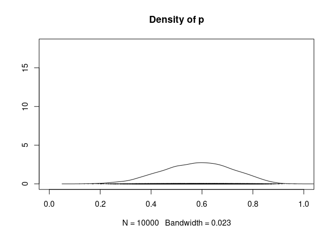
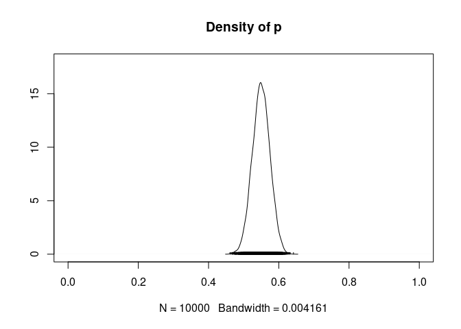
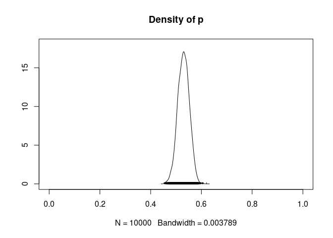

dc\_bayes\_rjags
================
Mohar Sen
6/13/2020

This document is my running notes of the course

``` r
library(ggplot2)
library(ggridges)
library(rjags)
```

    ## Loading required package: coda

    ## Linked to JAGS 4.3.0

    ## Loaded modules: basemod,bugs

## Bayesian elections

Past poll shows the following: Min - 30% Mean - 45% Max - 60%

  - You conduct small poll of 10 voters. 6 vote for you. Posterior is
    slightly more optimistic than the prior model
  - In another poll, 48 out of 90
  - In another poll, 166 of 300

Your posterior optimism of winning the votes is very high.

We will explore prior, likelihood and posterios

## Prior

Prior model of p is Beta distribution with shape parameters 45 and 55 p
\~ Beta(45,55)

## Exercise 1

Suppose you’re running in an election for public office. Let p be your
underlying support, the proportion of voters that plan to vote for you.
Based on past polls, your prior model of p

is captured by a Beta distribution with shape parameters 45 and 55.

You will approximate the Beta(45, 55) prior using random samples from
the rbeta() function. This function takes three arguments: sample size
(n) and two shape parameters (shape1,shape2). Subsequently, you will
construct a density plot of the samples using ggplot(). This function
takes two arguments: the data set containing the samples and, within
aes(), the variable to be plotted on the x axis. The density plot layer
is added using geom\_density().

``` r
# Sample 10000 draws from Beta(45,55) prior
prior_A <- rbeta(n = 10000, shape1 = 45, shape2 = 55)

# Store the results in a data frame
prior_sim <- data.frame(prior_A)

# Construct a density plot of the prior sample
ggplot(prior_sim, aes(x = prior_A)) + 
    geom_density()
```

<!-- -->

The Beta(a,b) distribution is defined on the interval from 0 to 1, thus
provides a natural and flexible prior for your underlying election
support, p. You can tune the Beta shape parameters a and b to produce
alternative prior models. Below you will compare your original
Beta(45,55) prior with two alternatives: Beta(1, 1) and Beta(100, 100).
The original 10,000 prior\_A samples drawn from Beta(45,55) are in your
workspace.

``` r
# Sample 10000 draws from the Beta(1,1) prior
prior_B <- rbeta(n = 10000, shape1 = 1, shape2 = 1)    

# Sample 10000 draws from the Beta(100,100) prior
prior_C <- rbeta(n = 10000, shape1 = 100, shape2 = 100)

# Combine the results in a single data frame
prior_sim <- data.frame(samples = c(prior_A, prior_B, prior_C),
        priors = rep(c("A","B","C"), each = 10000))

# Plot the 3 priors
ggplot(prior_sim, aes(x = samples, fill = priors)) + 
    geom_density(alpha = 0.5)
```

<!-- --> \#\#
Data

  - Parameter `p` = proportion that support you

  - Data `X = 6` of `n = 10` voters plan to vote for you

  - insights You are more likely to have observed these data if `p` \~
    0.6 rather than if `p` \< 0.5

Of course, you need to understand how the polling data depends on your
parameter `p`. You can make 2 reasonable assumptions on your polling
data

1.  Voters respond independently of one another
2.  Probability of each voter voting you is `p`

`X` = number of n polled voters that support you (Count of successes in
n independent trials, each having probability of success `p`)

  - Conditional distribution of `X` given `p`: `X ~ Bin(n,p)`

## Likelihood

  - There is a roughly 20% chance of you observing `X = 6` of `n = 10`
    if underlying `p` was 50%.
  - You would not witness `X` this low if the `p` was as high as 80%
  - There is also a “likelihood”, however small, that your real `p` is
    as small as 30% but you witnessed `X = 6`

The **likelihood function** summarizes the likelihood of observing
polling data `X` under different values of the underlying support
parameter `p`. It is a function of `p`

Let us simulate the likelihood function here.

### Simulating the dependence of `X` on `p`

In your quest for election to public office, your campaign polls 10
likely voters. Let `X` be the number that support you. Of course, `X`
varies from sample to sample and depends upon `p`, your underlying
support in the broader population. Since `X` is a count of successes in
10 independent trials, each having probability of success `p`, you can
model its dependence on `p` by the Binomial distribution: `Bin(10, p)`.

You will simulate the Binomial model using random samples from the
`rbinom(n, size, prob)` function. This vectorized function draws `n`
samples from a `Bin(size, prob)` distribution. Given a vector of prob
values, the first prob value will be used for the first draw, the second
prob value will be used for the second draw, etc.

``` r
# Define a vector of 1000 p values    
p_grid <- seq(from = 0, to = 1, length.out = 1000)

# Simulate 1 poll result for each p in p_grid   

poll_result <- rbinom(1000,10,p_grid)

# Create likelihood_sim data frame
likelihood_sim <- data.frame(p_grid, poll_result)    

# Density plots of p_grid grouped by poll_result
ggplot(likelihood_sim, aes(x = p_grid, y = poll_result, group = poll_result)) +
  geom_density_ridges()
```

    ## Picking joint bandwidth of 0.0385

<!-- -->
**Insight:** Notice that the polls where nobody supported you are from
the lower regions in the p\_grid. Opposite is true for polls where all
folks supported you.

### Approximating the likelihood function

The first election poll is in\! X = 6 of 10 polled voters plan to vote
for you. You can use these data to build insight into your underlying
support p. To this end, you will use the likelihood\_sim data frame (in
your workspace). This contains the values of X (poll\_result) simulated
from each of 1,000 possible values of p between 0 to 1 (p\_grid).

The ggplot() here constructs the distribution of p from which each
possible outcome of X was generated. Modify this code, supplying a fill
condition in order to highlight the distribution which corresponds to
your observed poll\_result, X=6. This provides insight into which values
of p are the most compatible with your observed poll data\!

``` r
# Density plots of p_grid grouped by poll_result
ggplot(likelihood_sim, aes(x = p_grid, y = poll_result, group = poll_result, fill = poll_result==6)) + 
    geom_density_ridges()
```

    ## Picking joint bandwidth of 0.0385

<!-- -->

Great\! Reexamine the highlighted density plot. This is a scaled
approximation of the likelihood function\! It indicates that the
simulated surveys in which 6 of 10 voters supported you corresponded to
underlying support p that ranged from approximately 0.25 to 1, with p
around 0.6 being the most common.

Put another way, the values of p which justifies 6 out of 10 can be
visualized as follows:

``` r
lklkhd <- function(theta){
  choose(10,6)*theta^6*(1-theta)^4
}
y = lklkhd(p_grid)

simulation <- data.frame(p_grid, y) 

ggplot(simulation, aes(x = p_grid, y = y))+
  geom_line()
```

<!-- -->

## Posterior

## RJAGS tutorial

### Define, compile, and simulate

In your election quest, let `p` be the proportion of the underlying
voting population that supports you. Built from previous polls &
election data, your prior model of `p` is a Beta(a,b) with shape
parameters a=45 and b=55. For added insight into `p`, you also polled
`n` potential voters. The dependence of `X`, the number of these voters
that support you, on `p` is modeled by the `Bin(n,p)` distribution.

In the completed poll, `X`=6 of `n`=10 voters supported you. The next
goal is to update your model of p in light of these observed polling
data\! To this end, you will use the rjags package to approximate the
posterior model of p. We break this exercise down into the 3 rjags
steps: define, compile, simulate.

**Step 1: Define the Bayesian model**

  - Specify that the likelihood model of X is `Bin(n,p)` and that the
    `p` prior is `Beta(a,b)`. In rjags syntax, these are specified by
    `dbin(p, n)` and `dbeta(a, b)`, respectively.
  - Store this model string as `vote_model`.

<!-- end list -->

``` r
### DEFINE the model
vote_model <- "model{
    # Likelihood model for X
    X ~ dbin(p,n)
    
    # Prior model for p
    p ~ dbeta(a,b)
}"
```

**Step 2: Compile the model using jags.model()**

  - Provide a `textConnection` to the defined `vote_model` and specify
    the data, including the prior parameters (a,b) & poll data (X,n).
    Ignore the inits argument for now - we’ll explore this in Chapter 2.
  - Store this jags object as vote\_jags.

<!-- end list -->

``` r
# COMPILE the model    
vote_jags <- jags.model(textConnection(vote_model), 
    data = list(a = 45, b = 55, X = 6, n = 10),
    inits = list(.RNG.name = "base::Wichmann-Hill", .RNG.seed = 100))
```

    ## Compiling model graph
    ##    Resolving undeclared variables
    ##    Allocating nodes
    ## Graph information:
    ##    Observed stochastic nodes: 1
    ##    Unobserved stochastic nodes: 1
    ##    Total graph size: 5
    ## 
    ## Initializing model

**Step 3: Simulate**

  - Simulate a sample of 10,000 draws from the p posterior using
    `coda.samples()`. This function takes 3 arguments: `model` (the
    compiled model), `variable.names` (the model parameter(s)), `n.iter`
    (sample size). Store this `mcmc.list` in `vote_sim`.
  - Construct a density `plot()` of the samples.

<!-- end list -->

``` r
vote_sim <- coda.samples(model = vote_jags, variable.names = c("p"), n.iter = 10000)

# PLOT the posterior
plot(vote_sim, trace = FALSE)
```

<!-- -->

**Notice** that after observing a poll in which 6 of 10 (60%) of voters
supported you, your updated posterior optimism and certainty about your
underlying support, p, are slightly higher than they were prior to the
poll.

### Updating the posterior

The posterior model of your underlying election support pis informed by
both the prior model of p and polling data X. Run the script to remind
yourself of the posterior that evolved from your original prior
(Beta(45, 55)) and original poll data (X=6 of n=10 polled voters support
you). The defined vote\_model is in your workspace.

In a 3-step exercise, you will explore how using a different prior model
or observing new data (or a combination of the two\!) might impact the
posterior.

**Step 1** Re-compile, simulate, and plot the p posterior to reflect the
setting in which you start with a Beta(1,1) prior but observe the same
polling data (X=6, n=10). NOTE: Recall that Beta(1,1) is uniform across
the (0,1) interval.

``` r
# COMPILE the model    
# COMPILE the model    
vote_jags <- jags.model(textConnection(vote_model), 
    data = list(a = 1, b = 1, X = 6, n = 10),
    inits = list(.RNG.name = "base::Wichmann-Hill", .RNG.seed = 100))
```

    ## Compiling model graph
    ##    Resolving undeclared variables
    ##    Allocating nodes
    ## Graph information:
    ##    Observed stochastic nodes: 1
    ##    Unobserved stochastic nodes: 1
    ##    Total graph size: 5
    ## 
    ## Initializing model

``` r
# SIMULATE the posterior
vote_sim <- coda.samples(model = vote_jags, variable.names = c("p"), n.iter = 10000)

# PLOT the posterior
plot(vote_sim, trace = FALSE, xlim = c(0,1), ylim = c(0,18))
```

<!-- -->

**Step 2** In a new poll, 214 of 390 voters support you. Combined with
the first poll, a total X=220 of n=400 voters support you. Re-compile,
simulate, and plot the p posterior to reflect these combined poll
results and a Beta(1,1) prior.

``` r
# COMPILE the model    
vote_jags <- jags.model(textConnection(vote_model), 
    data = list(a = 1, b = 1, X = 220, n = 400),
    inits = list(.RNG.name = "base::Wichmann-Hill", .RNG.seed = 100))
```

    ## Compiling model graph
    ##    Resolving undeclared variables
    ##    Allocating nodes
    ## Graph information:
    ##    Observed stochastic nodes: 1
    ##    Unobserved stochastic nodes: 1
    ##    Total graph size: 5
    ## 
    ## Initializing model

``` r
# SIMULATE the posterior
vote_sim <- coda.samples(model = vote_jags, variable.names = c("p"), n.iter = 10000)

# PLOT the posterior
plot(vote_sim, trace = FALSE, xlim = c(0,1), ylim = c(0,18))
```

<!-- -->

**Step 3** Finally, re-compile, simulate, and plot the p posterior to
reflect the combined poll results (X=220 of n=400) and your original
Beta(45,55) prior.

``` r
# COMPILE the model    
vote_jags <- jags.model(textConnection(vote_model), 
    data = list(a = 45, b = 55, X = 220, n = 400),
    inits = list(.RNG.name = "base::Wichmann-Hill", .RNG.seed = 100))
```

    ## Compiling model graph
    ##    Resolving undeclared variables
    ##    Allocating nodes
    ## Graph information:
    ##    Observed stochastic nodes: 1
    ##    Unobserved stochastic nodes: 1
    ##    Total graph size: 5
    ## 
    ## Initializing model

``` r
# SIMULATE the posterior
vote_sim <- coda.samples(model = vote_jags, variable.names = c("p"), n.iter = 10000)

# PLOT the posterior
plot(vote_sim, trace = FALSE, xlim = c(0,1), ylim = c(0,18))
```

<!-- -->
