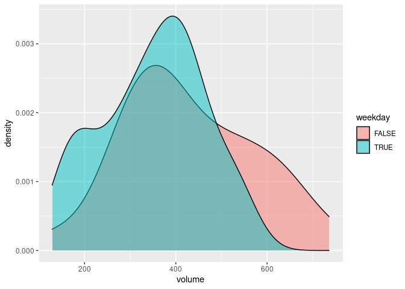
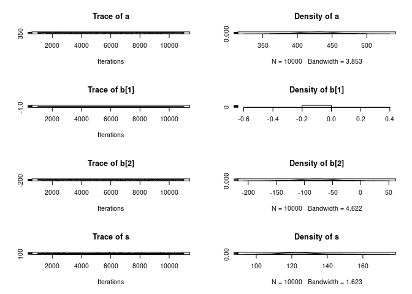
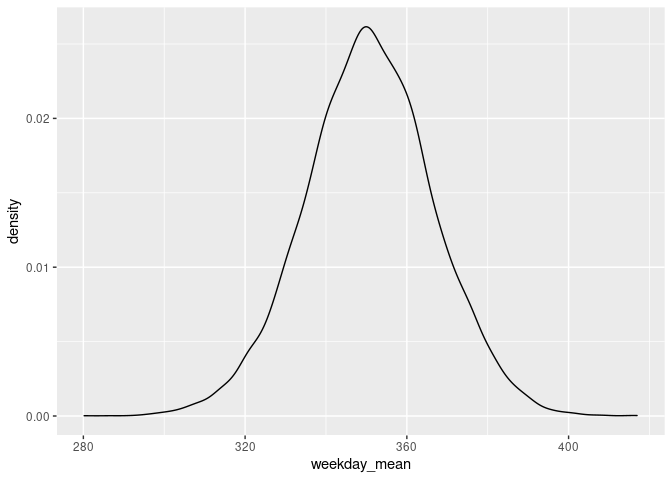
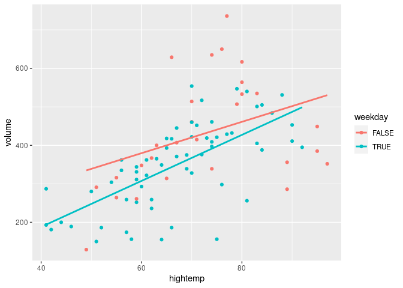
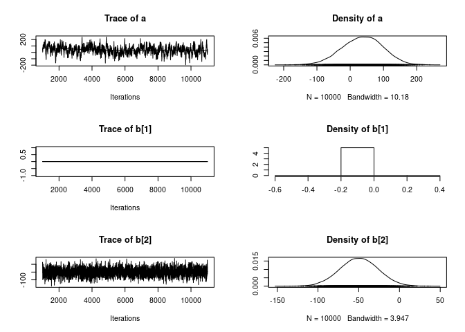
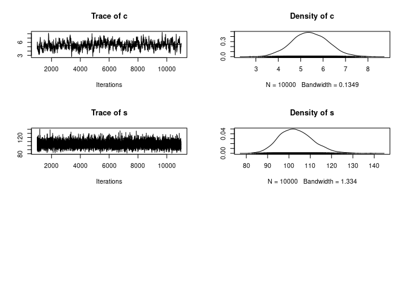
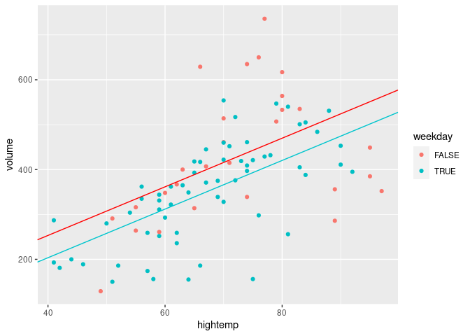
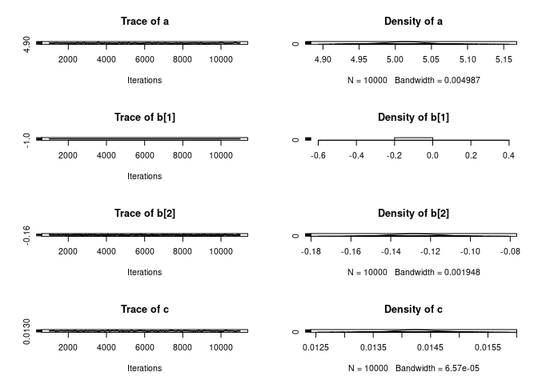
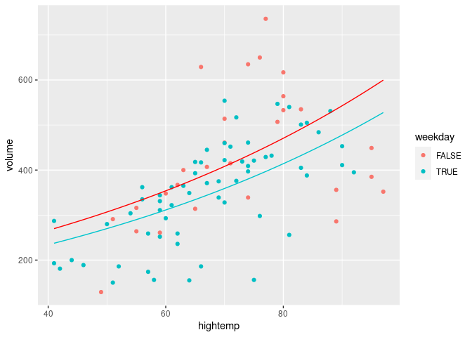
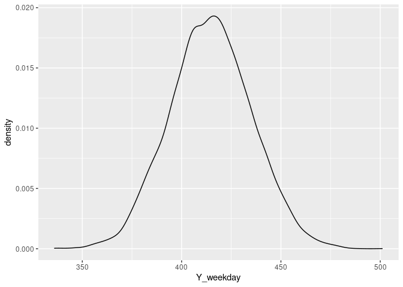

Multivariate and generalized linear models
================
Mohar Sen
6/15/2020

## Chapter 4 goals

  - Incorporate categorical predictors into Bayesian models
  - Engineer multivariate Bayesian regression models
  - Extend our methodology for Normal regression models to generalized
    linear models: Poisson regression

For starters, let’s load the RailTrail dataframe from mosaic package

``` r
library(rjags)
```

    ## Loading required package: coda

    ## Linked to JAGS 4.3.0

    ## Loaded modules: basemod,bugs

``` r
library(ggplot2)
library(dplyr)
```

    ## 
    ## Attaching package: 'dplyr'

    ## The following objects are masked from 'package:stats':
    ## 
    ##     filter, lag

    ## The following objects are masked from 'package:base':
    ## 
    ##     intersect, setdiff, setequal, union

``` r
library(mosaicData)
data(RailTrail)
```

`RailTrail` contains data collected by the Pioneer Valley Planning
Commission on the usage of a local rail-trail. For each of 90 days, they
recorded the rail-trail `volume` (number of users) and whether it was a
`weekday` (TRUE if yes and FALSE otherwise).

  - Confirm that `weekday` is recorded as a `factor` variable.
  - Construct density plots of weekday `volume` and weekend `volume` on
    the same frame.

<!-- end list -->

``` r
# Confirm that weekday is a factor variable
class(RailTrail$weekday)
```

    ## [1] "logical"

``` r
# Construct a density plot of volume by weekday
ggplot(RailTrail, aes(x = volume, fill = weekday)) + 
    geom_density(alpha = 0.5)
```

<!-- -->

## RJAGS simulation with categorical variables

Consider the Normal regression model of volume \(Y_i\) by weekday status
\(X_i\):

  - likelihood: \(Y_i \sim N(m_i, s^2)\) where \(m_i=a+bX_i\)
  - priors: \(a \sim N(400,100^2)\), \(b\sim N(0,200^2)\),
    \(s \sim Unif(0,200)\)

You explored the relationship between \(Y_i\) and \(X_i\) for the 90
days recorded in RailTrail (in your workspace). In light of these data
and the priors above, you will update your posterior model of this
relationship. This differs from previous analyses in that \(X_i\) is
categorical. In rjags syntax, its coefficient b is defined by two
elements, `b[1]` and `b[2]`, which correspond to the weekend and weekday
levels, respectively. For reference, `b[1]` is set to 0. In contrast,
`b[2]` is modeled by the prior for `b`.

**Instructions 1/3**

DEFINE your Bayesian model.

  - Define the likelihood model of `Y[i]` given `m[i]` and s where `m[i]
    <- a + b[X[i]]`. Note the new notation `b[X[i]]` here\!
  - Specify the priors for `a`, `b` (via `b[1]` and `b[2]`), and `s`.
  - Store the model string as rail\_model\_1.

<!-- end list -->

``` r
# DEFINE the model    
rail_model_1 <- "model{
    # Likelihood model for Y[i]
    for(i in 1:length(Y)) {
      Y[i] ~ dnorm(m[i], s^(-2))
      m[i] <- a + b[X[i]]
    }

    # Prior models for a, b, s
    a ~ dnorm(400, 100^(-2))
    b[1] <- 0
    b[2] ~ dnorm(0, 200^(-2))
    s ~ dunif(0, 200)
}"
```

**Instructions 2/3**

COMPILE rail\_model\_1 using jags.model():

  - Establish a `textConnection()` to `rail_model_1`.
  - Provide the observed `RailTrail` data.
  - Specify a starting random number generating seed of 10.
  - Store the output in a jags object named `rail_jags_1`.

<!-- end list -->

``` r
# COMPILE the model
rail_jags_1 <- jags.model(
  textConnection(rail_model_1),
  data = list(Y = RailTrail$volume, X = factor(RailTrail$weekday)),
  inits = list(.RNG.name = "base::Wichmann-Hill", .RNG.seed = 10)
)
```

    ## Compiling model graph
    ##    Resolving undeclared variables
    ##    Allocating nodes
    ## Graph information:
    ##    Observed stochastic nodes: 90
    ##    Unobserved stochastic nodes: 3
    ##    Total graph size: 194
    ## 
    ## Initializing model

Note: the compilation step was throwing an error, which was solved by
the response as shown in this stackoverflow question.

**Instructions 3/3**

  - SIMULATE a sample of 10,000 draws from the posterior model of `a`,
    `b`, and `s`. Store this mcmc.list as `rail_sim_1`.
  - Store the Markov chain output in a data frame named `rail_chains_1`.
    `+`plot()`the posterior samples in`rail\_sim\_1\`.

<!-- end list -->

``` r
# SIMULATE the posterior    
rail_sim_1 <- coda.samples(model = rail_jags_1, variable.names = c("a", "b", "s"), n.iter = 10000)

# Store the chains in a data frame
rail_chains_1 <- data.frame(rail_sim_1[[1]])

# PLOT the posterior
plot(rail_sim_1)
```

<!-- -->

**Interpreting coefficients**

``` r
summary(rail_sim_1)
```

    ## 
    ## Iterations = 1001:11000
    ## Thinning interval = 1 
    ## Number of chains = 1 
    ## Sample size per chain = 10000 
    ## 
    ## 1. Empirical mean and standard deviation for each variable,
    ##    plus standard error of the mean:
    ## 
    ##        Mean     SD Naive SE Time-series SE
    ## a    428.47 23.052  0.23052         0.5321
    ## b[1]   0.00  0.000  0.00000         0.0000
    ## b[2] -77.78 27.900  0.27900         0.6422
    ## s    124.25  9.662  0.09662         0.1335
    ## 
    ## 2. Quantiles for each variable:
    ## 
    ##        2.5%   25%    50%    75%  97.5%
    ## a     383.1 412.9 428.78 443.62 474.20
    ## b[1]    0.0   0.0   0.00   0.00   0.00
    ## b[2] -133.2 -96.3 -77.65 -59.43 -23.07
    ## s     107.5 117.3 123.59 130.32 144.90

We see that typically, there are \~428 trail users on a weekend day and
\~78 fewer users on a weekday. Exact number may vary depending on the
time of generation of this document.

### Inference for volume by weekday

You will utilize these simulation data to make inferences about weekday
trail volume.

**Instructions**

  - Combine the `a` and `b.2`. chain values to construct a chain of
    10,000 values for the typical weekday trail volume. Store this as
    `weekday_mea`n in `rail_chains_1`.
  - Use `ggplot()` to construct a density plot of the `weekday_mean`
    chain values.
  - Construct a 95% credible interval for the typical weekday trail
    volume.

<!-- end list -->

``` r
# Construct a chain of values for the typical weekday volume
rail_chains_1 <- rail_chains_1 %>% 
    mutate(weekday_mean = a + b.2.)

# Construct a density plot of the weekday chain
ggplot(rail_chains_1, aes(x = weekday_mean)) + 
    geom_density()
```

<!-- -->

``` r
# 95% credible interval for typical weekday volume
quantile(rail_chains_1$weekday_mean, probs=c(0.025, 0.975))
```

    ##     2.5%    97.5% 
    ## 318.9520 381.7573

## Multivariate Bayesian regression

In your previous work, you observed that rail-trail `volume` tends to be
lower on a `weekday` than a weekend. Some of the variability in `volume`
might also be explained by outside temperature. For example, we might
expect trail volume to increase on warm, pleasant days.

The `RailTrail` data set in your workspace includes `hightemp`, the
observed high temperature (F) for each of the 90 days in the study
period. You will use these data to explore the associations between
trail `volume`, `weekday` status, and `hightemp`

**Instructions**

### Construct a scatterplot of volume by hightemp:

  - Use `color` to distinguish between weekdays & weekends.
  - Use `geom_smooth()` to highlight the linear relationship between the
    observed `volume` & `hightemp` values.

<!-- end list -->

``` r
# Construct a plot of volume by hightemp & weekday
ggplot(RailTrail, aes(y = volume, x = hightemp, color = weekday)) + 
    geom_point() + 
    geom_smooth(method = "lm", se = FALSE)
```

    ## `geom_smooth()` using formula 'y ~ x'

<!-- -->

Notice that for the 90 days in the study period, volume tends to
increase with temperature. Further, volume tends to be higher on
weekends than on weekdays of the same temperature.

### RJAGS simulation for multivariate regression

Consider the following Bayesian model of volume Y i by weekday status Xi
and temperature Z

Consider the Normal regression model of volume \(Y_i\) by weekday status
\(X_i\) and temperature \(Z_i\):

  - likelihood: \(Y_i \sim N(m_i, s^2)\) where \(m_i=a+bX_i+cZ_i\)
  - priors: \(a \sim N(0,200^2)\), \(b\sim N(0,200^2)\),
    \(c \sim N(0,20^2)\), \(s \sim Unif(0,200)\)

Your previous exploration of the relationship between `volume`,
`weekday`, and `hightemp` in the `RailTrail` data provided some insight
into this relationship. You will combine this with insight from the
priors to develop a posterior model of this relationship using RJAGS.
The `RailTrail` data are in your work space.

**Instructions 1/3**

DEFINE your Bayesian model and store it as `rail_model_2`. Specifically,
utilizing the `dnorm()` and `dunif()` rjags functions:

  - For each of the 90 subjects \(i\), define \(m_i\) and the model of
    \(Y_i\) given \(m_i\) and \(s\) using RJAGS notation. To this end,
    remember that `b[X[i]]` is the rjags equivalent of \(bX_i\).
  - Specify the priors for `a`, `b`, `c`, and `s`.

<!-- end list -->

``` r
# DEFINE the model    
rail_model_2 <- "model{
    # Likelihood model for Y[i]
    for(i in 1:length(Y)) {
      Y[i] ~ dnorm(m[i], s^(-2))
      m[i] <- a + b[X[i]] + c*Z[i]
    }

    # Prior models for a, b, s
    a ~ dnorm(0, 200^(-2))
    b[1] <- 0
    b[2] ~ dnorm(0, 200^(-2))
    c ~ dnorm(0, 20^(-2))
    s ~ dunif(0, 200)
}"
```

**Instructions 2/3**

COMPILE `rail_model_2` using the `jags.model()` function with the
following details:

  - For reproducible results, specify a starting seed of 10 for the
    `base::Wichmann-Hill` random number generator `inits`.
  - Run 1 chain and store the output in a jags object named
    `rail_jags_2`.

<!-- end list -->

``` r
rail_jags_2 <- jags.model(textConnection(rail_model_2), 
    data = list(Y = RailTrail$volume, X = factor(RailTrail$weekday), Z = RailTrail$hightemp), 
    inits = list(.RNG.name = "base::Wichmann-Hill", .RNG.seed = 10))
```

    ## Compiling model graph
    ##    Resolving undeclared variables
    ##    Allocating nodes
    ## Graph information:
    ##    Observed stochastic nodes: 90
    ##    Unobserved stochastic nodes: 4
    ##    Total graph size: 385
    ## 
    ## Initializing model

**Instructions 3/3**

  - SIMULATE a sample of 10,000 draws from the posterior model of `a`,
    `b`, `c`, and `s`. Store this `mcmc.list` as `rail_sim_2`.
  - Store the Markov chain output in a data frame named `rail_chains_2`.
  - `plot()` the posterior samples in `rail_sim_2`.

<!-- end list -->

``` r
# SIMULATE the posterior    
rail_sim_2 <- coda.samples(model = rail_jags_2, variable.names = c("a", "b", "c", "s"), n.iter = 10000)

# Store the chains in a data frame
rail_chains_2 = data.frame(rail_sim_2[[1]])

# PLOT the posterior
plot(rail_sim_2)
```

<!-- --><!-- -->

### Interpreting multivariate regression parameters

``` r
summary(rail_sim_2)
```

    ## 
    ## Iterations = 1001:11000
    ## Thinning interval = 1 
    ## Number of chains = 1 
    ## Sample size per chain = 10000 
    ## 
    ## 1. Empirical mean and standard deviation for each variable,
    ##    plus standard error of the mean:
    ## 
    ##         Mean      SD Naive SE Time-series SE
    ## a     36.592 60.6238 0.606238        4.19442
    ## b[1]   0.000  0.0000 0.000000        0.00000
    ## b[2] -49.610 23.4930 0.234930        0.55520
    ## c      5.417  0.8029 0.008029        0.05849
    ## s    103.434  7.9418 0.079418        0.11032
    ## 
    ## 2. Quantiles for each variable:
    ## 
    ##         2.5%     25%     50%     75%   97.5%
    ## a    -83.443  -4.631  38.160  78.413 150.306
    ## b[1]   0.000   0.000   0.000   0.000   0.000
    ## b[2] -96.181 -65.468 -49.547 -33.633  -3.644
    ## c      3.865   4.865   5.402   5.965   7.007
    ## s     89.466  97.766 102.875 108.503 120.205

The posterior mean of c indicates that for both weekends and weekdays,
typical rail volume increases by \~5.4 users for every 1 degree increase
in temperature. . Typical volume is \~50 less on weekdays than on
weekends of the same temperature.

\#\#\#Posterior inference for multivariate regression

Construct a scatterplot of `volume` by `hightemp`.

  - Use `color` to distinguish between weekdays & weekends.
  - Superimpose a `red` line that represents the posterior mean trend of
    the linear relationship between `volume` and `hightemp` for
    weekends: `m = a + c Z`
  - Superimpose a `turquoise3` line that represents the posterior mean
    trend of the linear relationship between `volume` and `hightemp` for
    weekdays: `m = (a + b.2.) + c Z`

<!-- end list -->

``` r
# Plot the posterior mean regression models
ggplot(RailTrail, aes(x = hightemp, y = volume, color = weekday))+
  geom_point()+
  geom_abline(intercept = mean(rail_chains_2$a), slope = mean(rail_chains_2$c), color = "red")+
  geom_abline(intercept = mean(rail_chains_2$a+rail_chains_2$b.2.), slope = mean(rail_chains_2$c), color = "turquoise3")
```

<!-- -->

Posterior analysis suggests that there’s a positive association between
volume and temperature. Further, the typical weekday volume is less than
that on weekends of the same temperature.

## RJAGS simulation for Poisson regression

Consider the Poisson regression model of volume \(Y_i\) by weekday
status \(X_i\) and temperature \(Z_i\):

  - likelihood: \(Y_i \sim Pois(l_i)\) where \(log(l_i)=a+bX_i+cZ_i\)
  - priors: \(a \sim N(0,200^2)\), \(b\sim N(0,2^2)\),
    \(c \sim N(0,2^2)\)

**Instructions 1/3**

DEFINE your Bayesian model:

  - Use `dpois()` to define the likelihood model of `Y[i]` given `l[i]`.
  - Define the prior models for `a`, `b`, `c`.
  - Store the model string as `poisson_model`.

<!-- end list -->

``` r
# DEFINE the model    
poisson_model <- "model{
    # Likelihood model for Y[i]
    for(i in 1:length(Y)) {
      Y[i] ~ dpois(l[i])
      log(l[i]) <- a + b[X[i]] + c*Z[i]
    }

    # Prior models for a, b, s
    a ~ dnorm(0, 200^(-2))
    b[1] <- 0
    b[2] ~ dnorm(0, 2^(-2))
    c ~ dnorm(0, 2^(-2))
}"
```

**Instructions 2/3**

COMPILE `poisson_model` with the following details:

  - For reproducible results, specify a starting seed of 10 for the
    `base::Wichmann-Hill` random number generator inits.
  - Run 1 chain and store the output in a jags object named
    `poisson_jags`.

<!-- end list -->

``` r
# COMPILE the model
poisson_jags <- jags.model(textConnection(poisson_model),
                           data = list(Y = RailTrail$volume, X = factor(RailTrail$weekday), Z = RailTrail$hightemp),
                           inits = list(.RNG.name = "base::Wichmann-Hill", .RNG.seed = 10))
```

    ## Compiling model graph
    ##    Resolving undeclared variables
    ##    Allocating nodes
    ## Graph information:
    ##    Observed stochastic nodes: 90
    ##    Unobserved stochastic nodes: 3
    ##    Total graph size: 441
    ## 
    ## Initializing model

**Instructions 3/3**

  - SIMULATE a sample of 10,000 draws from the posterior model of `a`,
    `b`, and `c`. Store this `mcmc.list` as `poisson_sim`.
  - Store the Markov chain output in a data frame named
    `poisson_chains`.
  - `plot()` the posterior samples in `poisson_sim`.

<!-- end list -->

``` r
# SIMULATE the posterior    
poisson_sim <- coda.samples(model = poisson_jags,
                            variable.names = c("a", "b", "c"),
                            n.iter = 10000)

# Store the chains in a data frame
poisson_chains <- data.frame(poisson_sim[[1]])

# PLOT the posterior
plot(poisson_sim)
```

<!-- -->

### Plotting the Poisson regression model

Construct a scatterplot of `volume` by `hightemp`.

  - Use `color` to distinguish between weekdays & weekends.
  - Superimpose a `red` line that represents the posterior mean Poisson
    regression trend \(l_i\) of the linear relationship between `volume`
    and `hightemp` for weekends: `l = exp(a + cZ)`
  - Superimpose a `turquoise3` line that represents the posterior mean
    Poisson regression trend \(l_i\) of the linear relationship between
    `volume` and `hightemp` for weekdays: `m = (a + b.2.) + c Z`

<!-- end list -->

``` r
# Plot the posterior mean regression models
ggplot(RailTrail, aes(x = hightemp, y = volume, color = weekday))+
  geom_point() +
    stat_function(fun = function(x){exp(mean(poisson_chains$a) + mean(poisson_chains$c) * x)}, color = "red") + 
    stat_function(fun = function(x){exp(mean(poisson_chains$a) + mean(poisson_chains$b.2.) + mean(poisson_chains$c) * x)}, color = "turquoise3")
```

<!-- -->

### Inference for the Poisson rate parameter

Using these 10,000 unique sets of posterior plausible values for
parameters a, b, and c you will make inferences about the typical trail
volume on 80 degree days.

  - From each set of `poisson_chains` parameter values, calculate the
    typical trail volumes `l` on an 80 degree weekend day. Store these
    trends as a new variable, `l_weekend`, in poisson\_chains.

  - Similarly, calculate the typical trail volumes on an 80 degree
    weekday. Store these as a new variable, `l_weekday`.

  - Calculate 95% posterior credible intervals for the typical volume on
    an 80 degree weekend day and the typical volume on an 80 degree
    weekday.

<!-- end list -->

``` r
# Calculate the typical volume on 80 degree weekends & 80 degree weekdays
poisson_chains <- poisson_chains %>% 
    mutate(l_weekend = exp(a + c * 80)) %>% 
    mutate(l_weekday = exp(a + b.2. + c * 80))

# Construct a 95% CI for typical volume on 80 degree weekend
quantile(poisson_chains$l_weekend, probs = c(0.025, 0.975))
```

    ##     2.5%    97.5% 
    ## 462.1431 479.3101

``` r
# Construct a 95% CI for typical volume on 80 degree weekday
quantile(poisson_chains$l_weekday, probs = c(0.025, 0.975))
```

    ##     2.5%    97.5% 
    ## 407.4644 420.7102

### Poisson posterior prediction

Let’s predict trail volumes on the next 80 degree weekday. To do so, you
must take into account individual variability from the trend, modeled by
the likelihood \(Y_i \sim Pois(l_i)\).

Using `rpois(n, lambda)` for sample size `n` and rate parameter
`lambda`, you will simulate Poisson predictions of volume under each
value of the posterior plausible trend in `poisson_chains`.

``` r
# Simulate weekday predictions under each parameter set
poisson_chains <- poisson_chains %>% 
    mutate(Y_weekday = rpois(n = length(l_weekday), lambda = l_weekday))
    
# Construct a density plot of the posterior weekday predictions
ggplot(poisson_chains, aes(x = Y_weekday)) + 
    geom_density()
```

<!-- -->

``` r
# Posterior probability that weekday volume is less 400
mean(poisson_chains$Y_weekday<400)
```

    ## [1] 0.2288

Recall that one of our motivations in applying the Poisson model was to
accommodate the count nature of the volume data. This trickled down to
your volume predictions `Y_weekday` - notice that these predictions,
like the raw volume data, are discrete counts.
